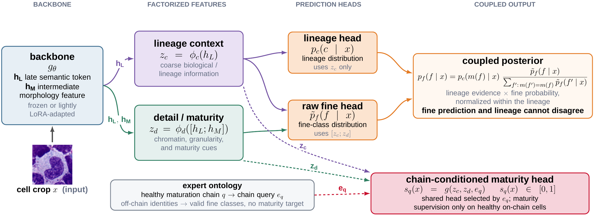
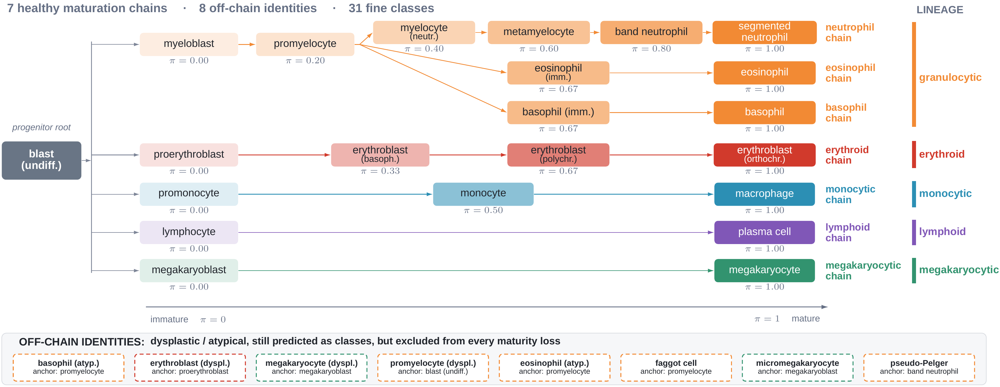

# HemaHier: Chain-Conditioned Ordinal Hierarchies for Lineage-Aware Bone-Marrow Cytology

<p align="center">
  <a href="https://arxiv.org/abs/2609.12835">
    
  </a>
  <a href="https://arxiv.org/abs/2609.12835">
    
  </a>
  <a href="https://github.com/xmindflow/HemaHier/releases/tag/mllv1">
    
  </a>
  <a href="LICENSE">
    
  </a>
  <br>
  <sub><sup>COMPAYL Workshop, MICCAI 2026</sup></sub>
</p>

Bone-marrow cytology is structured: every cell belongs to a hematopoietic lineage, and many cell types lie on ordered maturation trajectories. A flat classifier ignores both. It scores a mild same-lineage confusion exactly like a severe cross-lineage mistake, and it can only emit a discrete label.

HemaHier is an ordinal-hierarchical **prediction head** for a frozen or lightly adapted cytology foundation model:

- fine class and lineage are coupled into one **hierarchy-consistent posterior**,
  so a predicted cell type can never disagree with its predicted lineage;
- a **chain-conditioned maturity score** is read under a learned per-chain query,
  supervised only on biologically valid healthy chains;
- a **staged objective** stabilises recognition before adding lineage, maturity
  and within-chain ranking.



The result is competitive recognition with fewer and *milder* errors, plus a continuous within-lineage maturation ordering that a flat classifier cannot
express.

## Ontology

Lineages, healthy maturation chains and their normalized maturity targets π come from a fixed expert-curated taxonomy (`configs/labels_v2.json`). Dysplastic and atypical identities stay valid fine classes but sit on no chain, so they receive no maturity target, and the model never forces an abnormal cell onto a healthy developmental axis.



## What is here

Code for **HemaHier** and a flat linear-probe baseline on the public [MLLv1](https://doi.org/10.7937/TCIA.AXH3-T579) bone-marrow dataset (Matek et al. 2021): 171,374 cells, 21 source labels. The paper also reports two in-house bone-marrow cohorts that cannot be redistributed, so the numbers below are the MLLv1 ones, which reproduce end to end from this repository.

Five-fold checkpoints for both MLLv1 settings are published with the release. See [Pretrained weights](#pretrained-weights).

## Setup

```bash
git clone https://github.com/xmindflow/HemaHier.git && cd HemaHier
python -m venv .venv && source .venv/bin/activate
pip install -r requirements.txt
export PYTHONPATH="$PWD/src"
```

Tested with Python 3.11 and PyTorch 2.6 (CUDA 12.4). One 24 GB GPU is enough.
Copy `scripts/local.env.example` to `scripts/local.env` to pin the interpreter
or the dataset path.

### Backbone

[DinoBloom-S](https://github.com/marrlab/DinoBloom) (Koch et al. 2024), 21.6M parameters, downloaded from Hugging Face on first use:

```bash
./scripts/run.sh download-dinobloom
```

On top of the frozen backbone the HemaHier head adds 5.0 M trainable parameters, and a rank-16 LoRA adds a further 0.44 M.

### Data

Request MLLv1 from TCIA and unpack it. The expected layout is the one TCIA ships: one directory per class abbreviation (`ABE/`, `ART/`, `BAS/`, and 18 more), with the larger classes split further into numbered subdirectories. The scanner walks the tree recursively, so no reorganisation is needed, and there is no separate preprocessing step. The loader resizes each cell to 224×224 and applies augmentation and ImageNet normalization during training.

```bash
export MLLV1_ROOT=/path/to/Bone-Marrow-Cytomorphology_MLL_Helmholtz_Fraunhofer_v1
```

### Folds

The five folds are rebuilt locally from the files on disk and the split seed `2026`. The same command then checks them against the digests shipped with the paper:

```bash
PYTHONPATH=src python scripts/make_cv_splits.py mllv1
```

Each digest is a hash of the image paths relative to the dataset root, in the order that fold lists them. The fold file also stores the absolute path from the machine that built it, but that absolute path is not part of the hash. Training looks images up under `MLLV1_ROOT` using the relative path, so unpacking the dataset in another directory does not by itself change the check. What the digest expects is the same files, the same relative names, and seed `2026`, listed in the same order.

It must end with *Splits match the reference.* If it does not, this copy does not line up with the folds used in the paper, and the numbers will not be comparable.

## Train

```bash
GPUS=0,1,2 ./scripts/run.sh all          # Flat + HemaHier, frozen and LoRA
./scripts/run.sh hemahier                # HemaHier, frozen backbone
./scripts/run.sh hemahier_lora           # HemaHier, LoRA rank 16
./scripts/run.sh flat
./scripts/run.sh flat_lora
```

`DRY_RUN=1` prints the `train.py` command instead of running it, `--status` reports finished folds, and `FORCE=1` retrains. Budget roughly one GPU-hour per frozen fold and two per LoRA fold.

Each run writes `<output>/<exp_id>/{config.json, history.json, best_checkpoint.pt, completed.json}`. `config.json` is the full merged configuration and is enough to rebuild the run. Checkpoint selection is validation fine macro-F1.

The training configuration is in `configs/config.yaml`. Please read it there.

One fold by hand:

```bash
PYTHONPATH=src python src/train.py --exp_id HemaHier \
  --mllv1_root "$MLLV1_ROOT" --fold 0 --freeze_backbone \
  --output_dir runs/mllv1_hemahier/fold0
```

## Evaluate

Re-score a finished run from its checkpoint. The model is rebuilt from that run's own `config.json`, and every metric is recomputed and printed beside the value stored at training time:

```bash
PYTHONPATH=src python src/evaluate.py \
  runs/mllv1_hemahier/fold0/HemaHier --dataset_root "$MLLV1_ROOT"
```

## Pretrained weights

Five-fold checkpoints for both MLLv1 settings are attached to the [MLLv1 checkpoints release](https://github.com/xmindflow/HemaHier/releases/tag/mllv1): `mllv1_hemahier.tar` (frozen backbone) and `mllv1_hemahier_lora.tar` (LoRA rank 16).

```bash
./scripts/fetch_weights.sh                 # both settings, about 1.0 GB
./scripts/fetch_weights.sh hemahier        # frozen backbone only
./scripts/fetch_weights.sh hemahier_lora   # LoRA rank 16
```

The script checks each archive against the SHA256 recorded in `scripts/fetch_weights.sh`, then unpacks it into `weights/mllv1/`. Each fold keeps the `config.json` it was trained with, so it can be scored directly:

```bash
PYTHONPATH=src python src/evaluate.py \
  weights/mllv1/mllv1_hemahier/fold0/HemaHier_Cascade_Probe \
  --dataset_root "$MLLV1_ROOT"
```

`HemaHier_Cascade_Probe` and `HemaHier_Cascade_Probe_RA10` are the experiment ids these checkpoints were trained under. `configs/config.yaml` maps them onto `HemaHier` and `HemaHier_LoRA`.

## MLLv1 results

Five-fold cross-validation, mean±std. CLE is the cross-lineage error rate, TD the maturity-aware tree distance, and Mat-ρ the within-chain maturity rank correlation, which only HemaHier predicts. Lower is better for CLE and TD. Accuracy and F1 are over MLLv1's 21 source labels, while CLE and TD are defined by the ontology above.

| Backbone | Method             | Acc↑     | B-Acc↑   | M-F1↑    | W-F1↑    | Rare↑    | CLE↓     | TD↓      | Mat-ρ |
| -------- | ------------------ | --------- | --------- | --------- | --------- | --------- | --------- | --------- | ------ |
| frozen   | Flat               | 81.5±0.4 | 76.5±1.5 | 63.3±1.6 | 82.8±0.3 | 38.6±5.4 | 12.7±0.5 | 16.1±0.5 | --     |
| frozen   | **HemaHier** | 84.2±0.4 | 75.7±1.3 | 72.2±0.9 | 84.8±0.3 | 59.1±3.1 | 10.6±0.3 | 13.7±0.3 | 0.947  |
| LoRA r16 | Flat               | 86.9±0.4 | 79.2±1.3 | 76.3±1.4 | 87.4±0.3 | 65.0±5.3 | 8.8±0.3  | 11.4±0.3 | --     |
| LoRA r16 | **HemaHier** | 87.4±0.3 | 79.1±1.8 | 77.9±1.7 | 87.7±0.3 | 69.2±6.2 | 8.4±0.3  | 11.0±0.3 | 0.959  |

On the rare-class-imbalanced MLLv1, the frozen HemaHier head gains 8.9 points of fine macro-F1 and over twenty points of rare-class F1 over the flat probe, while lowering both severity metrics.

## Layout

```
configs/config.yaml               ontology, MLLv1 CV, training, methods
configs/labels_v2.json            canonical classes, lineages, maturation chains
assets/                           figures used in this README
src/train.py                      train one fold
src/evaluate.py                   re-score a finished run
src/models/hemahier_cascade.py    the model
src/models/flat_linear_probe.py   linear-probe baseline
src/loss.py                       HemaHierLoss + FlatCELoss
src/data/ontology.py              taxonomy, chains, evaluation distances
src/evaluation/                   recognition, severity and ordinal metrics
scripts/run.sh                    5-fold matrices
scripts/make_cv_splits.py         build the folds and check them against the paper
scripts/fetch_weights.sh          download the released checkpoints
```

## Citation

```bibtex
@inproceedings{bozorgpour2026hemahier,
  title     = {HemaHier: Chain-Conditioned Ordinal Hierarchies for Lineage-Aware Bone-Marrow Cytology},
  author    = {Bozorgpour, Afshin and Sch{\"u}ffler, Peter and Jost, Edgar and Merhof, Dorit},
  booktitle = {MICCAI Workshop on Computational Pathology with Multimodal Data (COMPAYL)},
  year      = {2026},
  eprint    = {2609.12835},
  archivePrefix = {arXiv},
  primaryClass  = {cs.CV},
}
```

## License

MIT (see [`LICENSE`](LICENSE)). MLLv1 is distributed by TCIA under its own terms and is not included here. DinoBloom weights follow their authors' license.
